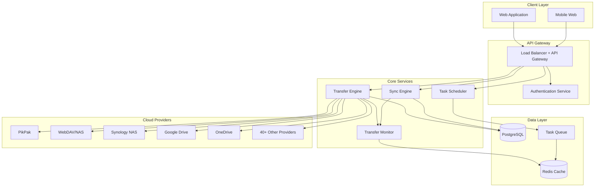
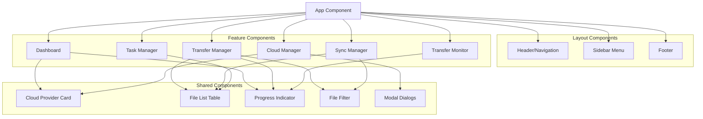
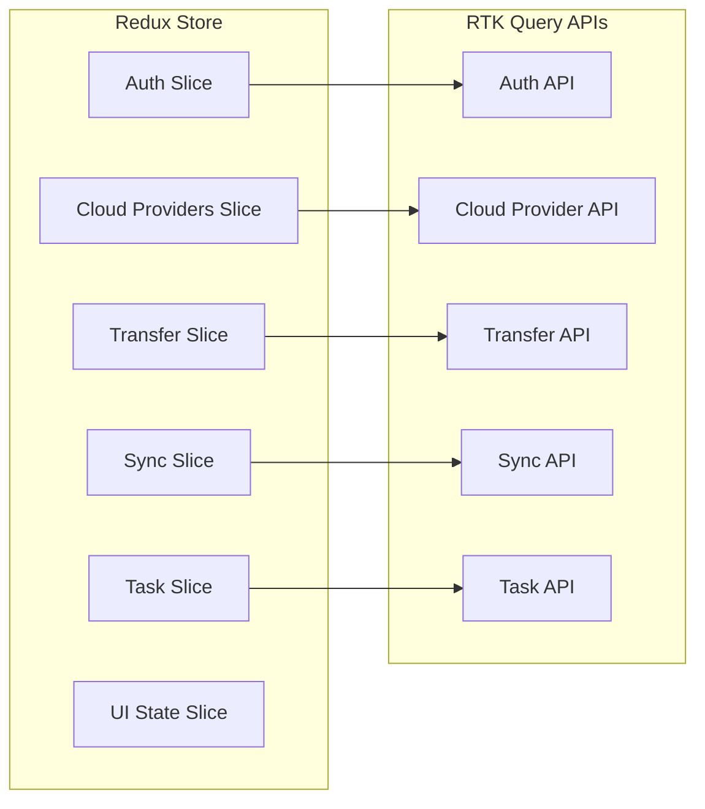
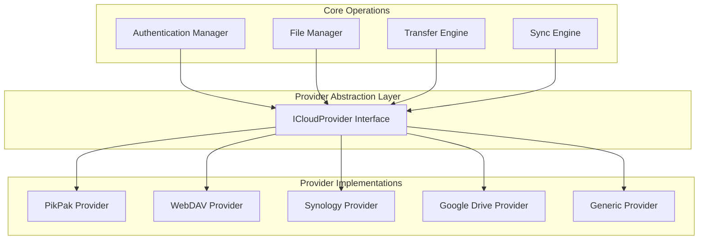
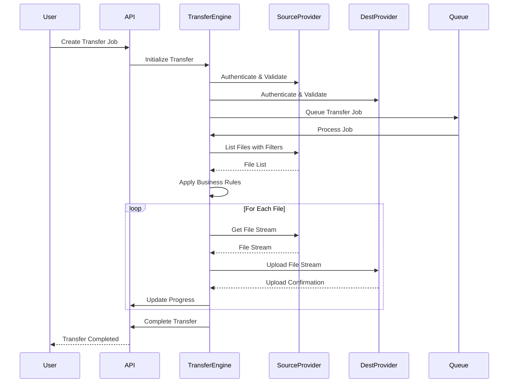
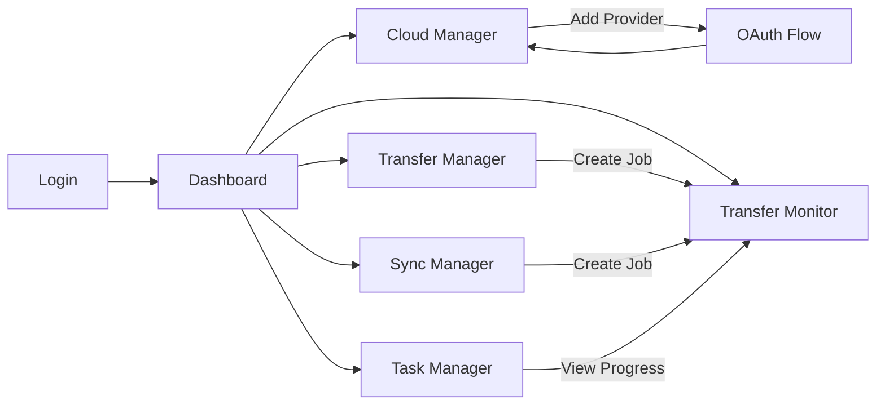

# CloudsLinker Platform Design

## Overview

CloudsLinker는 PikPak, WebDAV, Synology NAS를 핵심으로 지원하는 차세대 클라우드 스토리지 관리 플랫폼입니다. 로컬 대역폭을 전혀 사용하지 않는 클라우드 간 직접 전송을 통해 효율적이고 안전한 데이터 이동을 제공합니다.

### 핵심 가치 제안
- **제로 로컬 임팩트**: 모든 전송이 클라우드 간 직접 발생하여 로컬 대역폭 소비 없음
- **핵심 프로바이더 지원**: PikPak, WebDAV, Synology NAS 완벽 지원
- **고급 필터링**: 정밀한 파일 선택 및 조건부 전송
- **자동화 작업**: 스케줄링된 동기화 및 멀티태스크 실행
- **엔터프라이즈 보안**: 256-bit AES 암호화, OAuth 인증, GDPR 준수

### 주요 기능
- 클라우드 간 전송 및 동기화
- 다중 프로바이더 계정 통합 관리
- 고급 파일 필터링 및 선택
- 스케줄링된 자동화 작업
- 실시간 전송 모니터링
- 포괄적인 보안 및 개인정보 보호

## 기술 스택 및 의존성

### 프론트엔드 아키텍처
- **프레임워크**: React.js 18+ with TypeScript
- **상태 관리**: Redux Toolkit with RTK Query
- **UI 라이브러리**: Ant Design Pro (한국어 지원)
- **스타일링**: Tailwind CSS + Styled Components
- **라우팅**: React Router v6
- **빌드 도구**: Vite 4.0+
- **테스팅**: Jest + React Testing Library + Cypress
- **국제화**: React i18next (한국어/영어 지원)

### 백엔드 아키텍처
- **런타임**: Node.js 18+ with Express.js
- **언어**: TypeScript 5.0+
- **데이터베이스**: PostgreSQL 15+ with Redis 7+ for caching
- **인증**: OAuth 2.0 + JWT with refresh tokens
- **작업 큐**: Bull Queue 4.0+ with Redis
- **파일 처리**: Stream-based processing with memory optimization
- **API 문서**: OpenAPI 3.0 + Swagger UI
- **로깅**: Winston with structured logging

### 클라우드 통합 레이어
- **PikPak SDK**: Custom TypeScript SDK with OAuth 2.0
- **WebDAV 클라이언트**: webdav library with custom extensions
- **Synology API**: DSM API integration with session management
- **프로토콜 지원**: WebDAV, HTTPS, FTP/SFTP
- **인증 방식**: OAuth 2.0, API 키, 사용자명/비밀번호
- **네트워크**: HTTP/2, Connection pooling, Retry mechanisms

## Architecture

### System Architecture Overview



### Component Architecture

#### Frontend Components Hierarchy



#### State Management Architecture



## API Endpoints Reference

### Authentication Endpoints

| Method | Endpoint | Description |
|--------|----------|-------------|
| POST | `/api/auth/login` | User login with email/password |
| POST | `/api/auth/register` | User registration |
| POST | `/api/auth/refresh` | Refresh JWT token |
| POST | `/api/auth/logout` | User logout |
| GET | `/api/auth/profile` | Get user profile |

### Cloud Provider Management

| Method | Endpoint | Description |
|--------|----------|-------------|
| GET | `/api/clouds` | List connected cloud accounts |
| POST | `/api/clouds/connect` | Connect new cloud provider |
| DELETE | `/api/clouds/{id}` | Remove cloud connection |
| GET | `/api/clouds/{id}/files` | Browse files in cloud storage |
| GET | `/api/clouds/supported` | Get supported providers list |

### Transfer Operations

| Method | Endpoint | Description |
|--------|----------|-------------|
| POST | `/api/transfers` | Create new transfer job |
| GET | `/api/transfers` | List transfer jobs |
| GET | `/api/transfers/{id}` | Get transfer details |
| PUT | `/api/transfers/{id}/pause` | Pause transfer |
| PUT | `/api/transfers/{id}/resume` | Resume transfer |
| DELETE | `/api/transfers/{id}` | Cancel transfer |

### Sync Operations

| Method | Endpoint | Description |
|--------|----------|-------------|
| POST | `/api/sync` | Create sync job |
| GET | `/api/sync` | List sync jobs |
| PUT | `/api/sync/{id}` | Update sync settings |
| DELETE | `/api/sync/{id}` | Delete sync job |

### Request/Response Schema Examples

#### Connect Cloud Provider Request
```json
{
  "provider": "pikpak",
  "credentials": {
    "type": "oauth",
    "access_token": "string",
    "refresh_token": "string"
  },
  "alias": "My PikPak Account"
}
```

#### Transfer Job Creation Request
```json
{
  "source_cloud_id": "cloud_123",
  "destination_cloud_id": "cloud_456",
  "source_path": "/documents",
  "destination_path": "/backup/documents",
  "filters": {
    "include_patterns": ["*.pdf", "*.docx"],
    "exclude_patterns": ["*temp*"],
    "min_size": 1024,
    "max_size": 104857600
  },
  "options": {
    "overwrite_existing": false,
    "preserve_timestamps": true,
    "verify_integrity": true
  }
}
```

## Data Models & Database Schema

### User Model
```sql
CREATE TABLE users (
    id UUID PRIMARY KEY DEFAULT gen_random_uuid(),
    email VARCHAR(255) UNIQUE NOT NULL,
    password_hash VARCHAR(255) NOT NULL,
    first_name VARCHAR(100),
    last_name VARCHAR(100),
    subscription_tier VARCHAR(50) DEFAULT 'free',
    created_at TIMESTAMP DEFAULT NOW(),
    updated_at TIMESTAMP DEFAULT NOW()
);
```

### Cloud Provider Model
```sql
CREATE TABLE cloud_providers (
    id UUID PRIMARY KEY DEFAULT gen_random_uuid(),
    user_id UUID REFERENCES users(id) ON DELETE CASCADE,
    provider_type VARCHAR(50) NOT NULL,
    alias VARCHAR(100),
    credentials JSONB NOT NULL,
    is_active BOOLEAN DEFAULT true,
    last_connected TIMESTAMP,
    created_at TIMESTAMP DEFAULT NOW()
);
```

### Transfer Job Model
```sql
CREATE TABLE transfer_jobs (
    id UUID PRIMARY KEY DEFAULT gen_random_uuid(),
    user_id UUID REFERENCES users(id) ON DELETE CASCADE,
    source_cloud_id UUID REFERENCES cloud_providers(id),
    destination_cloud_id UUID REFERENCES cloud_providers(id),
    source_path TEXT NOT NULL,
    destination_path TEXT NOT NULL,
    status VARCHAR(20) DEFAULT 'pending',
    progress_percentage INTEGER DEFAULT 0,
    files_total INTEGER DEFAULT 0,
    files_completed INTEGER DEFAULT 0,
    bytes_total BIGINT DEFAULT 0,
    bytes_transferred BIGINT DEFAULT 0,
    filters JSONB,
    options JSONB,
    error_message TEXT,
    started_at TIMESTAMP,
    completed_at TIMESTAMP,
    created_at TIMESTAMP DEFAULT NOW()
);
```

### Sync Job Model
```sql
CREATE TABLE sync_jobs (
    id UUID PRIMARY KEY DEFAULT gen_random_uuid(),
    user_id UUID REFERENCES users(id) ON DELETE CASCADE,
    source_cloud_id UUID REFERENCES cloud_providers(id),
    destination_cloud_id UUID REFERENCES cloud_providers(id),
    source_path TEXT NOT NULL,
    destination_path TEXT NOT NULL,
    sync_mode VARCHAR(20) DEFAULT 'one_way',
    schedule_cron VARCHAR(100),
    is_active BOOLEAN DEFAULT true,
    last_sync TIMESTAMP,
    next_sync TIMESTAMP,
    filters JSONB,
    options JSONB,
    created_at TIMESTAMP DEFAULT NOW()
);
```

## Business Logic Layer

### Cloud Provider Integration Architecture



### Transfer Engine Business Logic

#### Transfer Process Flow



### PikPak Provider Implementation

```typescript
interface PikPakConfig {
  apiEndpoint: string;
  clientId: string;
  clientSecret: string;
}

class PikPakProvider implements ICloudProvider {
  private config: PikPakConfig;
  private accessToken: string;
  
  async authenticate(credentials: PikPakCredentials): Promise<void> {
    // OAuth 2.0 authentication flow
    // Handle token refresh
  }
  
  async listFiles(path: string, filters?: FileFilter): Promise<FileItem[]> {
    // API calls to PikPak endpoints
    // Apply filtering logic
  }
  
  async downloadFile(fileId: string): Promise<ReadableStream> {
    // Direct download stream
  }
  
  async uploadFile(path: string, stream: ReadableStream): Promise<FileItem> {
    // Chunked upload implementation
  }
}
```

### WebDAV Provider Implementation

```typescript
class WebDAVProvider implements ICloudProvider {
  private client: WebDAVClient;
  
  async authenticate(credentials: WebDAVCredentials): Promise<void> {
    // Basic/Digest authentication
    // SSL certificate handling
  }
  
  async listFiles(path: string): Promise<FileItem[]> {
    // PROPFIND requests
    // Parse XML responses
  }
  
  async downloadFile(path: string): Promise<ReadableStream> {
    // GET requests with streaming
  }
  
  async uploadFile(path: string, stream: ReadableStream): Promise<void> {
    // PUT requests with streaming
    // Handle WebDAV-specific headers
  }
}
```

### Synology NAS Provider Implementation

```typescript
class SynologyProvider implements ICloudProvider {
  private apiClient: SynologyAPIClient;
  
  async authenticate(credentials: SynologyCredentials): Promise<void> {
    // Synology DSM API authentication
    // Session management
  }
  
  async listFiles(path: string): Promise<FileItem[]> {
    // File Station API calls
    // Handle shared folders and permissions
  }
  
  async downloadFile(path: string): Promise<ReadableStream> {
    // Download via File Station API
  }
  
  async uploadFile(path: string, stream: ReadableStream): Promise<void> {
    // Upload via File Station API
    // Handle chunked uploads for large files
  }
}
```

## Routing & Navigation

### Route Structure

```typescript
const routes = [
  {
    path: '/',
    component: DashboardLayout,
    children: [
      { path: '', component: Dashboard },
      { path: 'clouds', component: CloudManager },
      { path: 'transfer', component: TransferManager },
      { path: 'sync', component: SyncManager },
      { path: 'tasks', component: TaskManager },
      { path: 'monitor', component: TransferMonitor },
      { path: 'settings', component: Settings }
    ]
  },
  {
    path: '/auth',
    component: AuthLayout,
    children: [
      { path: 'login', component: Login },
      { path: 'register', component: Register },
      { path: 'forgot-password', component: ForgotPassword }
    ]
  }
];
```

### Navigation Flow



## Styling Strategy

### Design System

#### Color Palette
- **Primary**: #1890FF (CloudsLinker Blue)
- **Secondary**: #52C41A (Success Green)
- **Warning**: #FAAD14 (Orange)
- **Error**: #FF4D4F (Red)
- **Neutral**: #F0F2F5 (Background Gray)

#### Component Styling Approach
- **Base Framework**: Tailwind CSS for utility classes
- **Component Library**: Ant Design with custom theme
- **CSS-in-JS**: Styled-components for complex components
- **Responsive Design**: Mobile-first approach with breakpoints

## State Management

### Redux Store Structure

```typescript
interface RootState {
  auth: {
    user: User | null;
    token: string | null;
    isAuthenticated: boolean;
  };
  
  cloudProviders: {
    providers: CloudProvider[];
    loading: boolean;
    error: string | null;
  };
  
  transfers: {
    jobs: TransferJob[];
    activeJob: TransferJob | null;
    loading: boolean;
  };
  
  sync: {
    jobs: SyncJob[];
    loading: boolean;
  };
  
  ui: {
    sidebarCollapsed: boolean;
    theme: 'light' | 'dark';
    notifications: Notification[];
  };
}
```

### RTK Query API Slices

```typescript
export const cloudProvidersApi = createApi({
  reducerPath: 'cloudProvidersApi',
  baseQuery: fetchBaseQuery({
    baseUrl: '/api/clouds',
    prepareHeaders: (headers, { getState }) => {
      headers.set('authorization', `Bearer ${getToken(getState())}`);
      return headers;
    },
  }),
  tagTypes: ['CloudProvider'],
  endpoints: (builder) => ({
    getCloudProviders: builder.query<CloudProvider[], void>({
      query: () => '',
      providesTags: ['CloudProvider'],
    }),
    connectProvider: builder.mutation<CloudProvider, ConnectProviderRequest>({
      query: (data) => ({
        url: '/connect',
        method: 'POST',
        body: data,
      }),
      invalidatesTags: ['CloudProvider'],
    }),
  }),
});
```

## API Integration Layer

### HTTP Client Configuration

```typescript
class APIClient {
  private axiosInstance: AxiosInstance;
  
  constructor() {
    this.axiosInstance = axios.create({
      baseURL: process.env.REACT_APP_API_BASE_URL,
      timeout: 30000,
    });
    
    this.setupInterceptors();
  }
  
  private setupInterceptors() {
    // Request interceptor for auth token
    this.axiosInstance.interceptors.request.use((config) => {
      const token = store.getState().auth.token;
      if (token) {
        config.headers.Authorization = `Bearer ${token}`;
      }
      return config;
    });
    
    // Response interceptor for error handling
    this.axiosInstance.interceptors.response.use(
      (response) => response,
      async (error) => {
        if (error.response?.status === 401) {
          store.dispatch(logout());
        }
        return Promise.reject(error);
      }
    );
  }
}
```

### WebSocket Integration for Real-time Updates

```typescript
class TransferMonitorSocket {
  private socket: Socket;
  
  constructor() {
    this.socket = io('/transfers', {
      auth: {
        token: store.getState().auth.token
      }
    });
    
    this.setupEventListeners();
  }
  
  private setupEventListeners() {
    this.socket.on('transfer:progress', (data) => {
      store.dispatch(updateTransferProgress(data));
    });
    
    this.socket.on('transfer:completed', (data) => {
      store.dispatch(completeTransfer(data));
    });
    
    this.socket.on('transfer:error', (data) => {
      store.dispatch(transferError(data));
    });
  }
}
```

## Testing Strategy

### Unit Testing

#### Component Testing Example
```typescript
describe('CloudProviderCard', () => {
  const mockProvider = {
    id: '1',
    type: 'pikpak',
    alias: 'My PikPak',
    isActive: true,
  };
  
  it('renders provider information correctly', () => {
    render(<CloudProviderCard provider={mockProvider} />);
    
    expect(screen.getByText('My PikPak')).toBeInTheDocument();
    expect(screen.getByText('PikPak')).toBeInTheDocument();
    expect(screen.getByTestId('active-indicator')).toBeInTheDocument();
  });
  
  it('handles disconnect action', async () => {
    const onDisconnect = jest.fn();
    render(
      <CloudProviderCard 
        provider={mockProvider} 
        onDisconnect={onDisconnect} 
      />
    );
    
    const disconnectBtn = screen.getByText('Disconnect');
    fireEvent.click(disconnectBtn);
    
    expect(onDisconnect).toHaveBeenCalledWith(mockProvider.id);
  });
});
```

#### API Testing Example
```typescript
describe('Transfer API', () => {
  beforeEach(() => {
    mock.onGet('/api/transfers').reply(200, mockTransfers);
  });
  
  it('fetches transfers successfully', async () => {
    const { result } = renderHook(() => 
      transfersApi.useGetTransfersQuery()
    );
    
    await waitFor(() => {
      expect(result.current.isSuccess).toBe(true);
      expect(result.current.data).toEqual(mockTransfers);
    });
  });
});
```

### Integration Testing

#### Transfer Flow Test
```typescript
describe('Transfer Flow Integration', () => {
  it('completes full transfer workflow', async () => {
    // 1. Connect cloud providers
    await connectPikPakProvider();
    await connectWebDAVProvider();
    
    // 2. Create transfer job
    const transferJob = await createTransferJob({
      sourceCloudId: 'pikpak-1',
      destinationCloudId: 'webdav-1',
      sourcePath: '/documents',
      destinationPath: '/backup'
    });
    
    // 3. Monitor transfer progress
    const finalStatus = await waitForTransferCompletion(transferJob.id);
    
    expect(finalStatus).toBe('completed');
  });
});
```

### End-to-End Testing

#### Cypress Test Example
```typescript
describe('Cloud Provider Management', () => {
  beforeEach(() => {
    cy.login('user@example.com', 'password');
    cy.visit('/clouds');
  });
  
  it('connects PikPak provider', () => {
    cy.get('[data-testid="add-provider-btn"]').click();
    cy.get('[data-testid="provider-pikpak"]').click();
    
    // Mock OAuth flow
    cy.window().then((win) => {
      win.postMessage({ type: 'OAUTH_SUCCESS', token: 'mock-token' });
    });
    
    cy.get('[data-testid="provider-alias"]').type('My PikPak');
    cy.get('[data-testid="connect-btn"]').click();
    
    cy.contains('My PikPak').should('be.visible');
    cy.get('[data-testid="provider-status"]').should('contain', 'Connected');
  });
});
```


